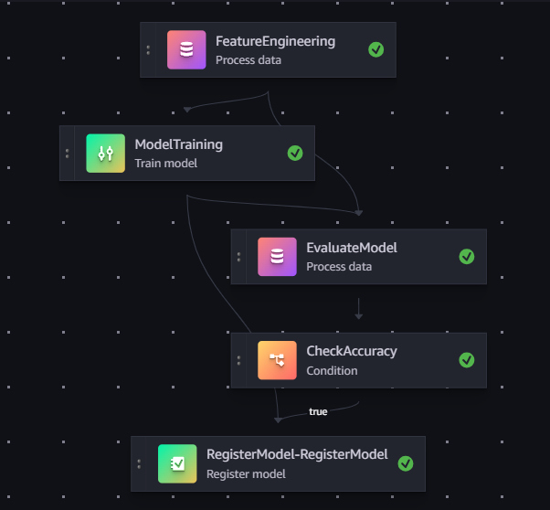

# Geo Busyness Prediction Pipeline

Predicts the busyness of geographic regions (H3 hexagons) based on courier location data.

## Quick Start

```bash
# Install (using uv)
uv sync

# Run tests
uv run pytest

# Run locally
uv run python main.py
```

## Project Structure

```
src/
├── core/
│   ├── data_ingestion.py      # Load from S3, clean NAs, create restaurant IDs
│   ├── feature_engineering.py # Distances, H3 indexes, cluster embeddings
│   ├── model_training.py      # RandomForest + GridSearchCV, MLflow logging
│   ├── validation.py          # Pydantic schemas for data quality checks
│   └── constants.py           # Shared feature columns, defaults
├── pipelines/
│   ├── sagemaker_processing.py # Feature engineering step for SageMaker
│   ├── sagemaker_training.py   # Training step for SageMaker
│   └── evaluate.py             # Model evaluation step
├── config/
│   └── config.yaml            # H3 resolution, model params, S3 paths
├── model_inference.py         # Inference logic (model_fn, predict_fn)
└── serve.py                   # Flask app for SageMaker endpoint

pipelines/
├── sagemaker_pipeline.py      # Defines SageMaker Pipeline (steps, conditions)
├── deploy_model.py            # Creates/updates SageMaker endpoint
├── approve_model.py           # Approves model in registry
└── upload_config.py           # Uploads config.yaml to S3

tests/
├── unit/                      # Tests for individual functions
└── integration/               # End-to-end pipeline tests

.github/workflows/
├── ci.yml                     # Runs pytest on every push
└── sagemaker-pipeline.yml     # Builds, deploys on main/dev
```

## Pipeline Architecture



```
Raw Data (S3) → Feature Engineering → Training → Evaluation → [Conditional] → Model Registry → Endpoint
```

| Step | Description |
|------|-------------|
| **Feature Engineering** | Calculates distances (Euclidean, Haversine), H3 indexes, cluster embeddings |
| **Training** | Random Forest with GridSearchCV hyperparameter tuning |
| **Evaluation** | Computes R² score on test set |
| **Conditional Check** | **Model is registered only if R² ≥ 0.6** (60%) |
| **Deployment** | Registers model in SageMaker Model Registry, deploys to endpoint |

## CI/CD


| Workflow | Trigger | What it does |
|----------|---------|--------------|
| CI | Every push | Runs pytest |
| CD | After CI passes on `main`/`dev` | Builds Docker → Runs SageMaker pipeline → Deploys |

### CD Workflow Steps

1. **Build & Push Image** — Builds Docker image, pushes to ECR
2. **Upload Config** — Uploads `config.yaml` to S3
3. **Run SageMaker Pipeline** — Executes feature engineering, training, evaluation
4. **Approve Model** — Approves model in registry (if R² ≥ 0.6)
5. **Deploy Model** — Creates/updates SageMaker endpoint

## Design Decisions

- **SageMaker over Vertex AI** - More familiar with AWS ecosystem
- **Config in S3** - Allows param changes without image rebuild
- **MLflow tracking** - Experiment tracking for model comparison
- **Pydantic validation** - Catches bad data early (lat/lon range checks)
- **Conditional model registration** - Only models with R² ≥ 0.6 get deployed
- **Separate processing/training steps** - Allows caching and parallel execution
- **Docker containerization** - Reproducible environment across dev/prod
- **GitHub Actions OIDC** - Secure AWS auth without long-lived credentials

## Environment Variables

Set these in GitHub Secrets:
- `AWS_OIDC_ROLE_ARN` - For GitHub OIDC auth
- `SAGEMAKER_ROLE_ARN` - SageMaker execution role
- `AWS_REGION` - e.g., `us-east-1`
