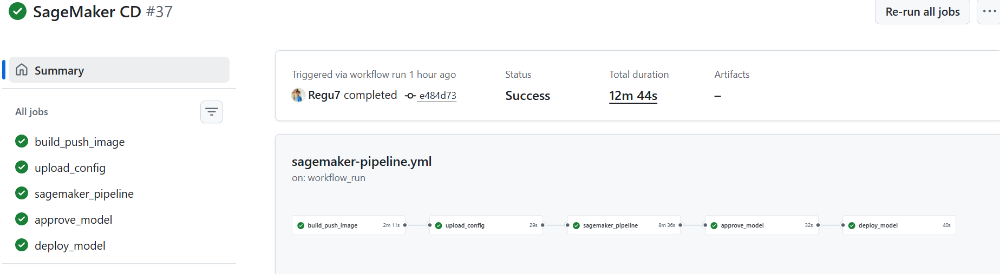

# Geo Busyness Prediction Pipeline

This application predicts geographic busyness levels for delivery optimization.
It uses machine learning to analyze courier movements and restaurant data.

## Quick Start

```bash
# Install (using uv)
uv sync

# Run tests
uv run pytest

# Run locally
uv run python main.py
```

## Project Structure

```
src/
├── core/
│   ├── data_ingestion.py      # Load from S3, clean NAs, create restaurant IDs
│   ├── feature_engineering.py # Distances, H3 indexes, cluster embeddings
│   ├── model_training.py      # RandomForest + GridSearchCV, MLflow logging
│   ├── validation.py          # Pydantic schemas for data quality checks
│   └── constants.py           # Shared feature columns, defaults
├── inference/
│   ├── model_inference.py     # Inference logic (model_fn, predict_fn, input_fn, output_fn)
│   └── serve.py               # Flask app for SageMaker endpoint
├── pipelines/
│   ├── sagemaker_processing.py # Feature engineering step for SageMaker
│   ├── sagemaker_training.py   # Training step for SageMaker
│   └── evaluate.py             # Model evaluation step
└── config/
    └── config.yaml            # H3 resolution, model params, S3 paths

pipelines/
├── sagemaker_pipeline.py      # Defines SageMaker Pipeline (steps, conditions)
├── deploy_model.py            # Creates/updates SageMaker endpoint
├── approve_model.py           # Approves model in registry
└── upload_config.py           # Uploads config.yaml to S3

tests/
├── unit/                      # Tests for individual functions
└── integration/               # End-to-end pipeline tests

.github/workflows/
├── ci.yml                     # Runs pytest on every push
└── sagemaker-pipeline.yml     # Builds, deploys on main/dev
```

## Pipeline Architecture


```
Raw Data (S3) → Feature Engineering → Training → Evaluation → [Conditional] → Model Registry → Endpoint
```

| Step | Description |
|------|-------------|
| **Feature Engineering** | Calculates distances (Euclidean, Haversine), H3 indexes, cluster embeddings |
| **Training** | Random Forest with GridSearchCV hyperparameter tuning |
| **Evaluation** | Computes R² score on test set |
| **Conditional Check** | **Model is registered only if R² ≥ 0.6** (60%) |
| **Deployment** | Registers model in SageMaker Model Registry, deploys to endpoint |

## CI/CD



| Workflow | Trigger | What it does |
|----------|---------|--------------|
| CI | Every push | Runs pytest |
| CD | After CI passes on `main`/`dev` | Builds Docker → Runs SageMaker pipeline → Deploys |

### CD Workflow Steps

1. **Build & Push Image** — Builds Docker image, pushes to ECR
2. **Upload Config** — Uploads `config.yaml` to S3
3. **Run SageMaker Pipeline** — Executes feature engineering, training, evaluation
4. **Approve Model** — Approves model in registry (if R² ≥ 0.6)
5. **Deploy Model** — Creates/updates SageMaker endpoint

### Branch-Based Deployment

The pipeline segregates everything for production and development environments based on the Git branch:

- **Main branch**: Code pushed to `main` uses production services and is served live. Environment variables (pod variables) are set for production resources (e.g., prod SageMaker endpoints, MLflow servers).
- **Dev branch**: Code pushed to `dev` uses development services for testing and staging. Environment variables are configured for dev resources to avoid impacting production.

This separation ensures safe development without affecting live systems.

## Serving

The model is served via API Gateway, which routes requests to the SageMaker endpoint for inference.

## Design Decisions

- **SageMaker over Vertex AI** - More familiar with AWS ecosystem
- **Config in S3** - Allows param changes without image rebuild
- **Separate processing/training steps** - Allows caching and parallel execution
- **MLflow tracking** - Experiment tracking for model comparison with Sagemkaer Mlflow
- **Modular inference code** - Organized in `src/inference/` for better maintainability
- **Pydantic validation** - Catches bad data early (lat/lon range checks)
- **Docker containerization** - Reproducible environment across dev/prod
- **Conditional model registration** - Only models with R² ≥ 0.6 get deployed
- **GitHub Actions OIDC** - Secure AWS auth without long-lived credentials
- **API Gateway serving** - Provides a secure, scalable interface for the SageMaker endpoint
- **uv for dependency management** - Fast, modern Python packaging tool
- **Ruff for linting and formatting** - Fast Python linter and code formatter

## Environment Variables

Set these in GitHub Secrets:
- `AWS_OIDC_ROLE_ARN` - For GitHub OIDC auth
- `SAGEMAKER_ROLE_ARN` - SageMaker execution role
- `AWS_REGION` - e.g., `us-east-1`

## Implementation Issues in Notebook

When refactoring the original PoC notebook, I identified several implementation issues that were addressed in the productionized project. For instance, the data collection relied on hardcoded file paths and lacked any validation, which could lead to silent failures with bad data. This was fixed by integrating S3-based loading and Pydantic schemas for robust input checking.

Feature engineering had inefficiencies too, like the manual K-means clustering for the five-clusters embedding, which was hardcoded and didn't converge properly. While it's now modularized, it could still benefit from switching to sklearn's KMeans++ for better cluster assignment and performance. Distance calculations were also optimized from slow list comprehensions to vectorized operations.

A major concern was data leakage in the target variable calculation. The orders_busyness_by_h3_hour was computed using counts from the entire dataset, meaning the training set inadvertently "knew" about test set information. In production, this must be calculated within time windows or strictly on the training split to avoid overfitting.

Other areas like model training lacked proper artifact saving and evaluation metrics, which are now handled with MLflow and conditional deployment. Overall, the notebook's monolithic structure was broken into modular scripts, adding logging, testing, and CI/CD for a reliable ML pipeline.
